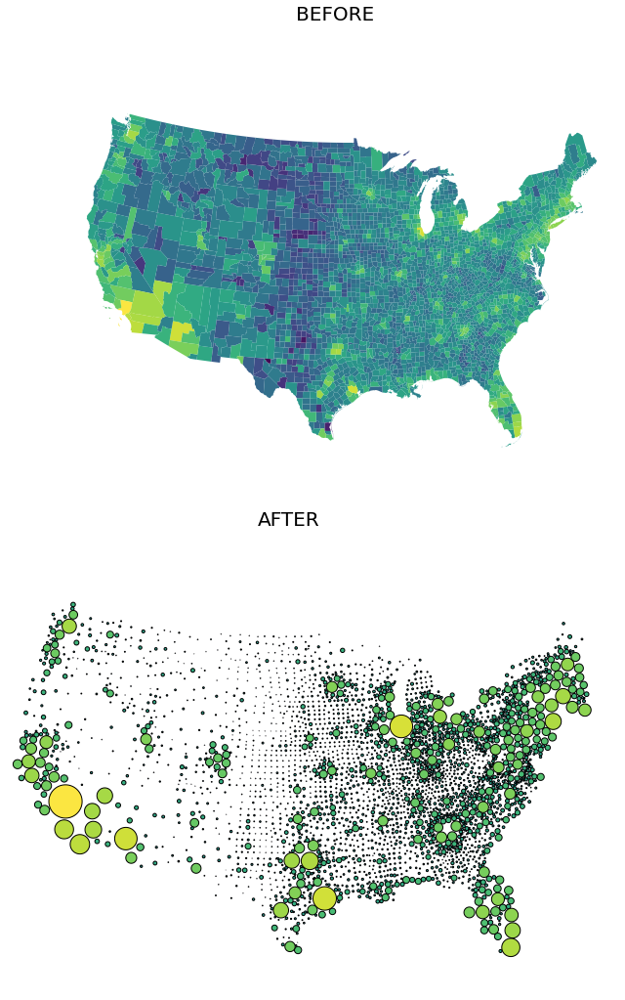

.. _bs:

Bubble Scaler
==============

Simple Example
^^^^^^^^^^^^^^^^

NOTE: This example uses the variable ``df`` as seen in the example in :ref:`lcm`.
::

    import mapscaler as ms
    import numpy as np
    
    bs = ms.BubbleScaler()
    bubble_df = bs.scale_map(df, 'scaleby', usa_albers=True, 
                   map_vel=.001, group_Vel=.15, verbose=True)

If ``verbose``, :func:`~mapscaler.BubbleScaler.scale_map` will print progress as it goes (truncated below):

.. code-block:: none

    Iteration 1
    --93 overlapping groups remaining
    Iteration 2
    --89 overlapping groups remaining
    ...
    [truncated]
    ...
    Iteration 42
    --2 overlapping groups remaining
    Iteration 43
    --2 overlapping groups remaining
    Iteration 44
    Separated in 44 iterations 

Now, let's visualize the output ``bubble_df``:
::

    import matplotlib.pyplot as plt
    import geoplot as gplt
    import geoplot.crs as gcrs
    import numpy as np

    gplt.choropleth(
        df, hue=[np.log(x) for x in df.EST_POP_2019],
        projection=gcrs.AlbersEqualArea(),
        figsize=(15,8),
    )
    plt.suptitle('BEFORE', fontsize=20, ha='center')
    plt.show()      

    gplt.choropleth(
        bubble_df, hue=[np.log(x) for x in df.EST_POP_2019],
        figsize=(15,8),
    )
    plt.suptitle('AFTER', fontsize=20, ha='center')
    plt.show()

Documentation
^^^^^^^^^^^^^^

.. currentmodule:: mapscaler
.. autoclass:: BubbleScaler
    :members:
    :undoc-members:
    :inherited-members:
    :show-inheritance:
