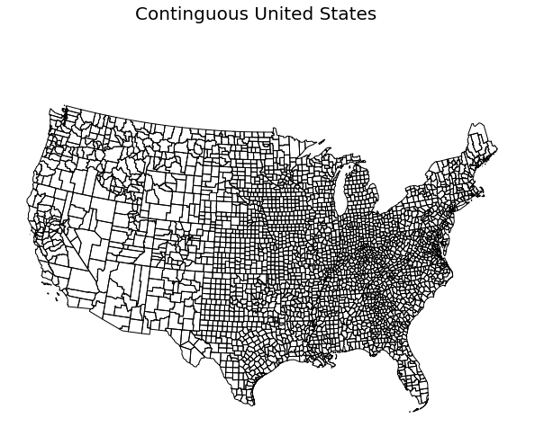

.. _lcm:

Loading Common Maps
======================

Simple Example 
^^^^^^^^^^^^^^^^

Import MapScaler and load a map of the US Counties:
::

    import mapscaler as ms
    loader = ms.MapLoader()
    df = loader.fetch_counties()['df']

That's it! You now have a map of the states. 
::

    import matplotlib.pyplot as plt
    import geoplot as gplt
    import geoplot.crs as gcrs

    #Reduce to the lower 48 for an easier demonstration
    df = df[df.STATE_FIPS != '02'] # AK
    df = df[df.STATE_FIPS != '15'] # HI
    df = df[df.STATE_FIPS != '72'] # HI
    
    gplt.polyplot(
        df, 
        projection=gcrs.AlbersEqualArea(),
        figsize=(15,8),
        )
    plt.suptitle('Continguous United States', fontsize=20, ha='center')
    plt.show()

Documentation
^^^^^^^^^^^^^^

.. currentmodule:: mapscaler
.. autoclass:: MapLoader
    :members:
    :undoc-members:
    :inherited-members:
    :show-inheritance:
