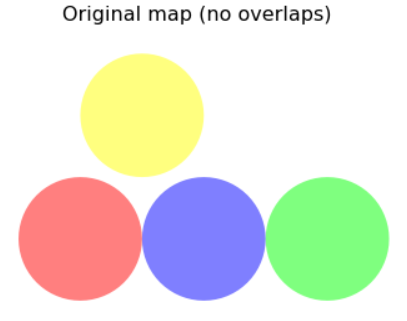
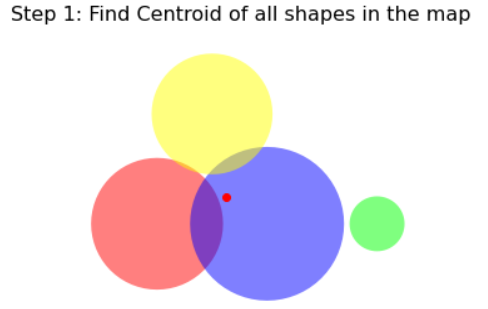
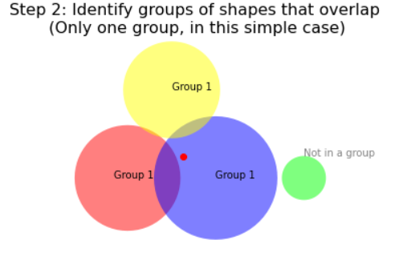
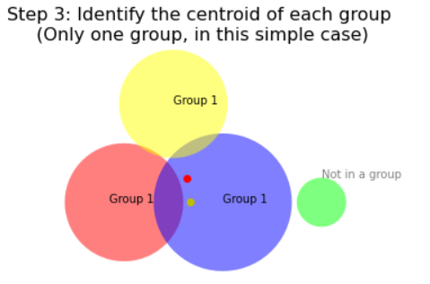
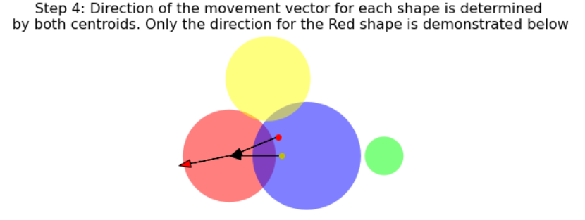

Technical Details: Rearranging shapes
=========================================

:ref:`ss` works iteratively, gently and strategically nudging the polygons in your map until they don't overlap. Below is a quick overview, using 4 circles to create a minimalist example.

Suppose these circles are scaled by a variable, and as a consequence, there's some unwanted overlap:

.. image:: ../images/scaled.png
    :align: center

The first step to removing overlap is to find the geometric centroid of the map, all shapes included:

Next, organize all the shapes into groups with other shapes they overlap. Shapes that don't overlap any others do not need to be moved, so they are not members of any group.

Next, find the centroid of each group:

The direction that each shape will move is a function of its position in relation to BOTH the map centroid, and its group centroid. The degree to which each centroid relation is considered in the formation of the direction vector is determined by the arguments ``map_vel`` and ``group_vel``. In most cases, the group centroid should be the primary driver of the direction vector, and the map centroid should just be included minimally to achieve faster resolution in maps with dense groups.

.. image:: ../images/step5.png
    :align: center  

The :ref:`bs` works the same way after first converting all shapes in your map to circles with the equivalent area.

