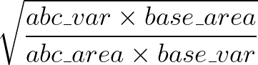
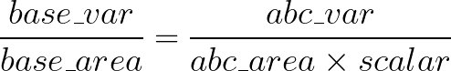
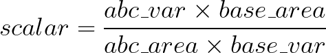

.. _scalars:

Creating Shape Scalars from a Variable
========================================

In this tutorial, we'll use a GeoPandas dataframe with 2 columns: a ``geometry`` column of US county shapes, and a population column of numeric values. (Of course, the following steps will work for other variables besides population - any numeric input will do.

Data Prep and Cleaning
^^^^^^^^^^^^^^^^^^^^^^^

Import MapScaler and load a map of the US States:
::

    import mapscaler as ms
    loader = ms.MapLoader()
    df = loader.fetch_counties()['df']

We'll restrict this example to the continuous 48 for easier visualizations, so let's drop Alaska, Hawaii, and Puerto Rico.
::

    df = df[df.STATE_FIPS != '02'] # AK
    df = df[df.STATE_FIPS != '15'] # HI
    df = df[df.STATE_FIPS != '72'] # HI

Step 1: Choose a 'base' for scale
^^^^^^^^^^^^^^^^^^^^^^^^^^^^^^^^^^^

First, store the area of each shape as a columns in your dataframe. You can pull this in from an official GIS source (Such as the Census Bureau), or you can calculate the areas directly using the GeoPandas Shapely objects, which we'll do here:
::

    df['area'] = [ shape.area for shape in df['geometry'] ]

While scalars clearly define proportions, they do not specify any sizes specifically. For example, California's populations is about 13x larger than Nevada's population. This could be satisfied by respective areas of 13 and 1, 130 and 10, 13 million and 1 million, etc. You must specificy some anchor for the overall scale of the new map.

There's no reliable programmatic way to choose this scale, because it depends highly on the distribution of shapes in your chart. Here's the extremes:

* You could choose the densest state for your base (New Jersey). New Jersey would remain the same size, and all other states would shrink. The result would be mathematically accurate proportions between states, but they would all be very small and spaced out, an ugly visualization.
* You could choose the least dense state for your base (Alaska). Alaska would remain the same size, and all the other states would expand dramatically. The increased states would all overlap each other, and MapScaler will take a very long time to find a solution with no overlapping states, and by that point, the states will have been rearranged so much that the solution will likely not be recognizeable as a map of the US.

In short, it's a tradeoff between having large individual shapes, and having a map with an overall shape that still resembles the original. Therefore, the best rule of thumb is to pick a shape somewhere in the 60th-80th percentile of variable density. This will result in over half your states shrinking and less than half of them increasing. Start there and tweak as needed.

In this tutorial, we'll use Ohio, the 10th densest state by Population. Store the variable value (population) and the area of your base:
::

    base_population = df[df.NAME == 'Ohio']['EST_POP_2019'].values[0]
    base_area = df[df.NAME == 'Ohio']['area'].values[0]

Step 2: Create Scalars
^^^^^^^^^^^^^^^^^^^^^^^

Given base values for area and a variable ``var``, this formula will calculate the appropriate scalar by which to adjust the area of given shape ``abc``:

Formula Explanation
---------------------

The goal is to scale the area of shape ``abc`` until it has the same variable-to-area ratio as the base, like so:

Solving for ``scalar`` gives:

Finally, when you scale a shape's coordinates by some scalar :math:`x`, the area scales at :math:`x2` (see Additional Reading below). Therefore, to scale the area of a shape, the area scalar is the square root of each coordinate scalar.
::

    df['scaleby'] = ( (df['EST_POP_2019']*base_area) / (df['area']*base_population) )**.5

This ``scaleby`` column is ready to be passed as input to :ref:`ss` or :ref:`bs`, which will be covered next.

Additional Reading
^^^^^^^^^^^^^^^^^^^^

* `Square-Cube Law <https://en.wikipedia.org/wiki/Square-cube_law>`_
* `Calculating the scale factor to resize a polygon to a specific size <https://math.stackexchange.com/questions/1889423/calculating-the-scale-factor-to-resize-a-polygon-to-a-specific-size>`_

